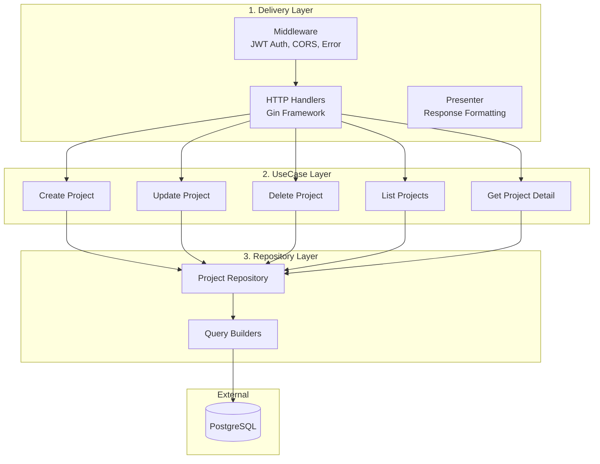
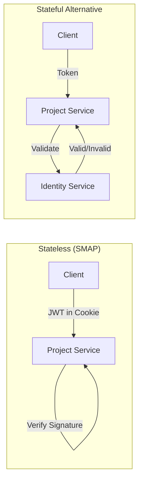
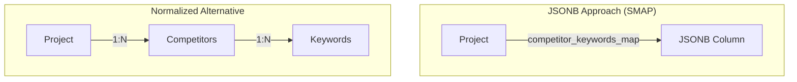
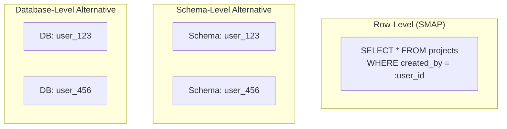
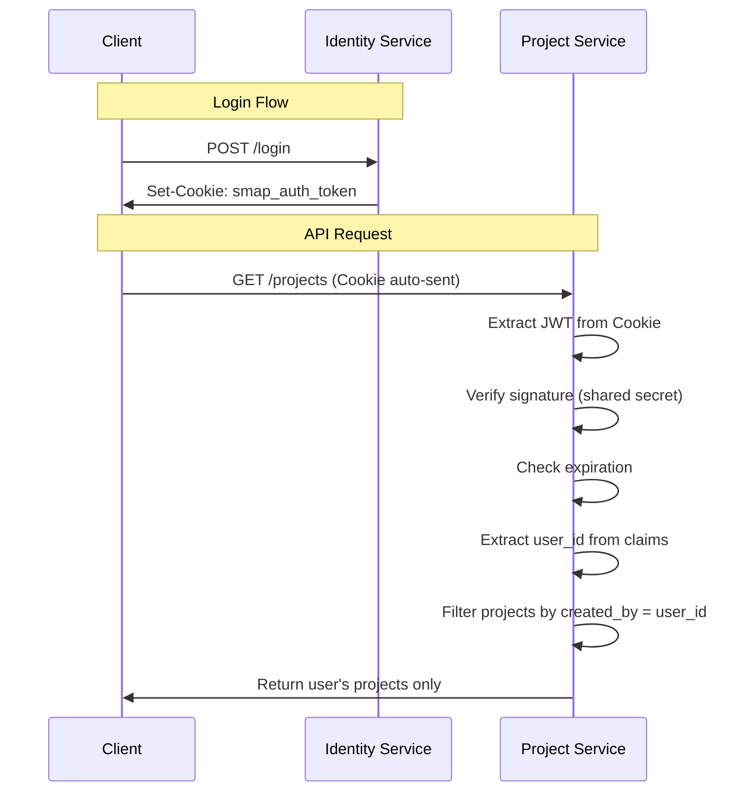
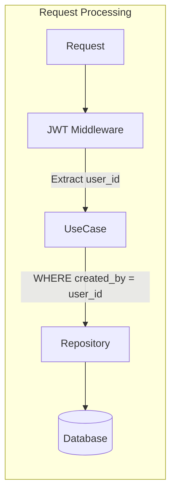
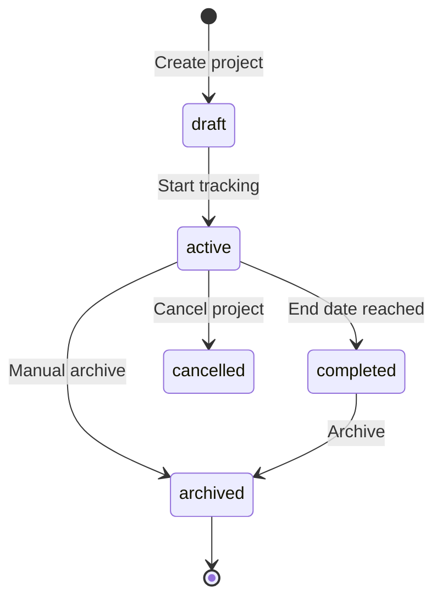
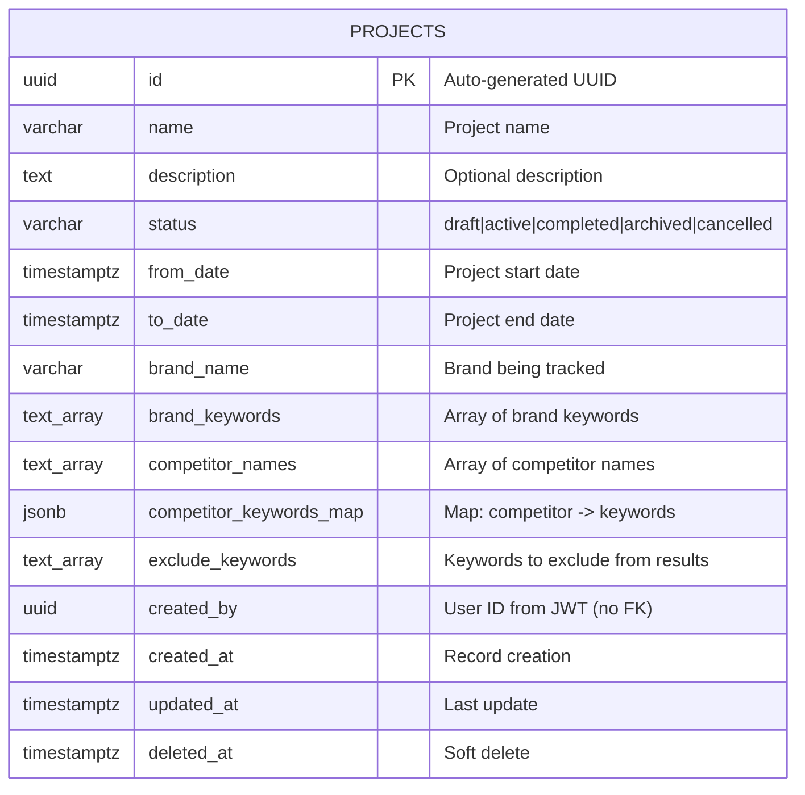
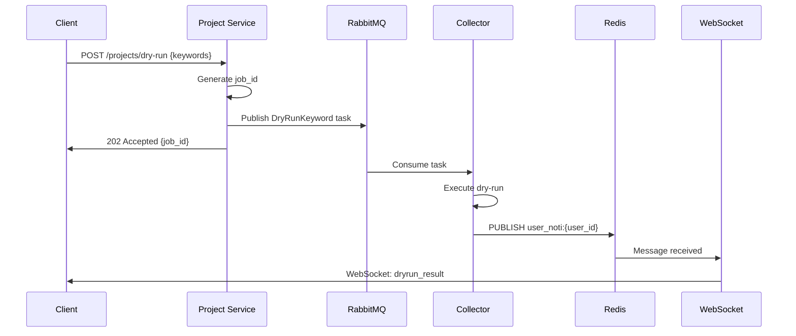
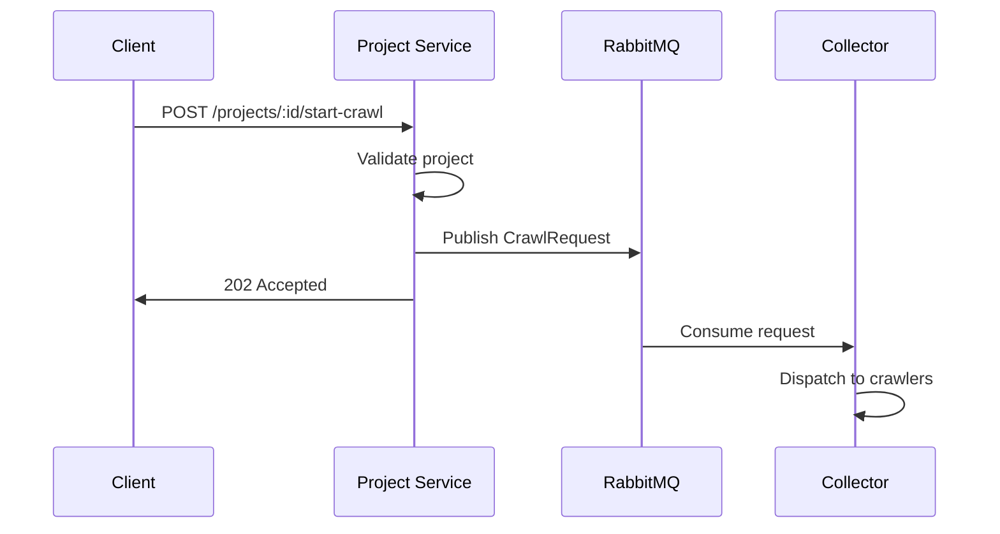

# Project Service

## Tổng Quan

**Project Service** là service quản lý project và theo dõi thương hiệu cho nền tảng SMAP. Service này cung cấp các chức năng:

- **Project Management**: CRUD operations cho projects
- **Brand Tracking**: Theo dõi thương hiệu và keywords
- **Competitor Analysis**: Phân tích đối thủ cạnh tranh
- **User Isolation**: Mỗi user chỉ truy cập được project của mình

### Đặc Điểm Chính

| Đặc điểm | Mô tả |
|----------|-------|
| **Port** | 8080 |
| **Database** | PostgreSQL 15 |
| **Authentication** | JWT từ Identity Service |
| **Architecture** | Clean Architecture (3 layers) |

## Clean Architecture

Project Service sử dụng **3-layer Clean Architecture**:



### Layer Responsibilities

#### 1. Delivery Layer
- **HTTP Handlers**: Xử lý REST API requests
- **JWT Middleware**: Validate token từ Identity Service
- **Presenter**: Format response data

#### 2. UseCase Layer
- **Business Logic**: Validation, authorization
- **User Isolation**: Kiểm tra ownership
- **Date Validation**: from_date < to_date

#### 3. Repository Layer
- **Data Access**: CRUD operations

## Design Patterns và Trade-offs

### 1. Stateless JWT Validation

Project Service validate JWT **không cần gọi API** đến Identity Service:



| Approach | Latency | Coupling | Consistency |
|----------|---------|----------|-------------|
| **Stateless (SMAP)** | ⭐⭐⭐⭐⭐ No network | ⭐⭐⭐⭐⭐ Loose | ⭐⭐⭐ Token expiry |
| **Stateful (API call)** | ⭐⭐ Network hop | ⭐⭐ Tight | ⭐⭐⭐⭐⭐ Real-time |
| **Shared Session** | ⭐⭐⭐ Redis lookup | ⭐⭐⭐ Medium | ⭐⭐⭐⭐⭐ Real-time |

**Trade-offs:**
- ✅ Zero latency cho validation
- ✅ Identity Service down không ảnh hưởng
- ❌ Không thể revoke token ngay lập tức
- ❌ Cần shared secret giữa services

### 2. JSONB cho Flexible Schema



| Approach | Query Performance | Flexibility | Data Integrity |
|----------|-------------------|-------------|----------------|
| **JSONB (SMAP)** | ⭐⭐⭐ GIN index | ⭐⭐⭐⭐⭐ Schema-less | ⭐⭐⭐ App-level |
| **Normalized** | ⭐⭐⭐⭐⭐ B-tree | ⭐⭐ Rigid | ⭐⭐⭐⭐⭐ FK constraints |
| **EAV Pattern** | ⭐⭐ Complex joins | ⭐⭐⭐⭐⭐ Very flexible | ⭐⭐ Weak |

**Lý do chọn JSONB:**
- Competitor keywords có structure không cố định
- Tránh complex joins khi query
- PostgreSQL JSONB có GIN index support

### 3. Soft Delete Pattern

| Approach | Data Recovery | Query Complexity | Storage |
|----------|---------------|------------------|---------|
| **Soft Delete (SMAP)** | ⭐⭐⭐⭐⭐ Easy | ⭐⭐⭐ WHERE deleted_at IS NULL | ⭐⭐⭐ More |
| **Hard Delete** | ⭐ Impossible | ⭐⭐⭐⭐⭐ Simple | ⭐⭐⭐⭐⭐ Less |
| **Archive Table** | ⭐⭐⭐⭐⭐ Easy | ⭐⭐⭐⭐⭐ Simple | ⭐⭐⭐ Separate |

### 4. User Isolation Strategy



| Approach | Isolation | Scalability | Complexity |
|----------|-----------|-------------|------------|
| **Row-Level (SMAP)** | ⭐⭐⭐ App-enforced | ⭐⭐⭐⭐⭐ Single DB | ⭐⭐⭐⭐⭐ Simple |
| **Schema-Level** | ⭐⭐⭐⭐ DB-enforced | ⭐⭐⭐ Many schemas | ⭐⭐⭐ Medium |
| **Database-Level** | ⭐⭐⭐⭐⭐ Full | ⭐⭐ Many DBs | ⭐⭐ Complex |
- **Query Builders**: Filtering, pagination, sorting
- **SQLBoiler**: Type-safe queries

## JWT Validation từ Identity Service

### Stateless Authentication

Project Service validate JWT **không cần gọi API** đến Identity Service:



### JWT Claims Structure

```json
{
  "user_id": "uuid",
  "username": "email@example.com",
  "role": "USER",
  "exp": 1234567890,
  "iat": 1234567890
}
```

### User Isolation




## Features

### Project CRUD Operations

| Operation | Endpoint | Mô tả |
|-----------|----------|-------|
| **Create** | POST `/projects` | Tạo project mới |
| **Read** | GET `/projects/:id` | Lấy chi tiết project |
| **Update** | PUT `/projects/:id` | Cập nhật project |
| **Delete** | DELETE `/projects/:id` | Soft delete project |
| **List** | GET `/projects` | Danh sách projects của user |
| **Paginate** | GET `/projects/page` | Danh sách với pagination |

### Brand Tracking

Mỗi project theo dõi một thương hiệu với các keywords:

```json
{
  "brand_name": "MyBrand",
  "brand_keywords": ["mybrand", "my brand", "#mybrand"]
}
```

### Competitor Analysis

Theo dõi nhiều đối thủ cạnh tranh với keywords riêng:

```json
{
  "competitor_names": ["Competitor A", "Competitor B"],
  "competitor_keywords_map": {
    "Competitor A": ["comp-a", "competitor-a"],
    "Competitor B": ["comp-b", "competitor-b"]
  }
}
```

### Project Status



| Status | Mô tả |
|--------|-------|
| **draft** | Đang soạn thảo |
| **active** | Đang theo dõi |
| **completed** | Đã hoàn thành |
| **archived** | Đã lưu trữ |
| **cancelled** | Đã hủy |

## Data Model

### Entity Relationship Diagram



### Field Details

| Field | Type | Mô tả |
|-------|------|-------|
| **id** | UUID | Auto-generated với `gen_random_uuid()` |
| **name** | VARCHAR | Tên project (required) |
| **description** | TEXT | Mô tả project (optional) |
| **status** | VARCHAR | Enum: draft, active, completed, archived, cancelled |
| **from_date** | TIMESTAMPTZ | Ngày bắt đầu tracking |
| **to_date** | TIMESTAMPTZ | Ngày kết thúc (phải > from_date) |
| **brand_name** | VARCHAR | Tên thương hiệu đang theo dõi |
| **brand_keywords** | TEXT[] | PostgreSQL array type |
| **competitor_names** | TEXT[] | Danh sách tên đối thủ |
| **competitor_keywords_map** | JSONB | Map: competitor → keywords |
| **exclude_keywords** | TEXT[] | Keywords cần loại trừ |
| **created_by** | UUID | User ID từ JWT (không có FK) |

### JSONB Structure Example

```json
{
  "competitor_keywords_map": {
    "Apple": ["apple", "iphone", "macbook", "@apple"],
    "Samsung": ["samsung", "galaxy", "@samsung"],
    "Google": ["google", "pixel", "android", "@google"]
  }
}
```

### Dry-Run Keywords Feature

Project Service hỗ trợ tính năng **Dry-Run Keywords** để test keywords trước khi crawl thật:



## Database Indexes

```sql
-- Query by user
CREATE INDEX idx_projects_created_by ON projects(created_by);

-- Filter by status
CREATE INDEX idx_projects_status ON projects(status);

-- Exclude soft-deleted
CREATE INDEX idx_projects_deleted_at ON projects(deleted_at);
```

## API Endpoints

### Projects

| Method | Endpoint | Mô tả | Auth |
|--------|----------|-------|------|
| GET | `/projects` | Danh sách projects của user | ✅ |
| GET | `/projects/page` | Danh sách với pagination | ✅ |
| GET | `/projects/:id` | Chi tiết project | ✅ |
| POST | `/projects` | Tạo project mới | ✅ |
| PATCH | `/projects/:id` | Cập nhật một phần project | ✅ |
| DELETE | `/projects/:id` | Soft delete project | ✅ |
| POST | `/projects/dry-run` | Test keywords trước khi crawl | ✅ |

### Request Example

```bash
curl -X POST https://smap-api.tantai.dev/project/projects \
  -b cookies.txt \
  -H "Content-Type: application/json" \
  -d '{
    "name": "Q1 2025 Campaign",
    "status": "draft",
    "from_date": "2025-01-01T00:00:00Z",
    "to_date": "2025-03-31T23:59:59Z",
    "brand_name": "MyBrand",
    "brand_keywords": ["mybrand", "my brand"],
    "competitor_names": ["Competitor A"],
    "competitor_keywords_map": {
      "Competitor A": ["competitor-a", "comp-a"]
    }
  }'
```

## Validation Rules

| Rule | Mô tả |
|------|-------|
| **Date Range** | `to_date` phải sau `from_date` |
| **Status** | Phải là một trong các giá trị enum |
| **Ownership** | User chỉ có thể access project của mình |
| **Name Required** | Tên project không được trống |

## Integration với Collector Service

Project Service có thể trigger crawl requests:


