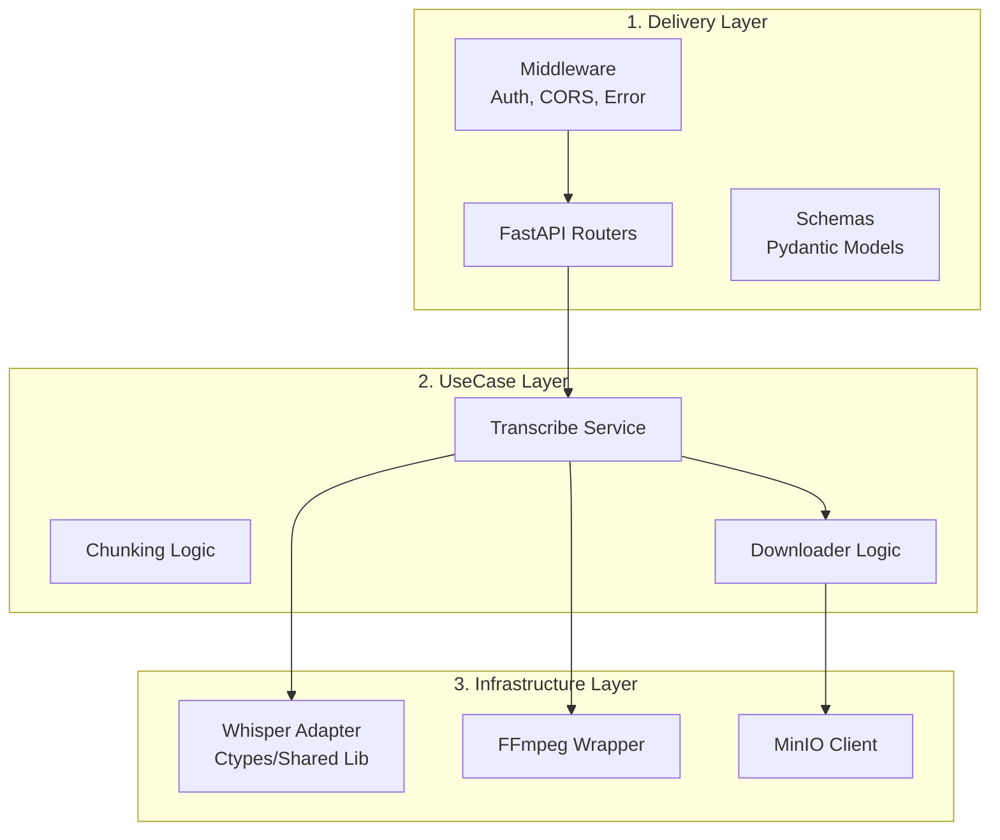
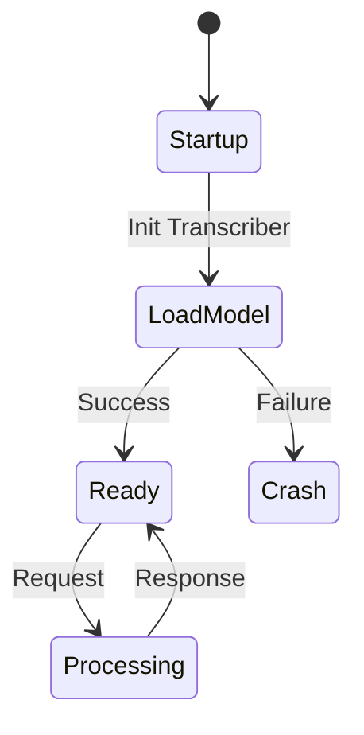
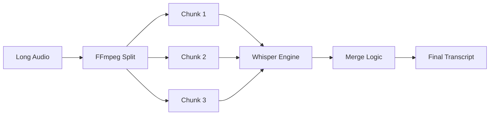
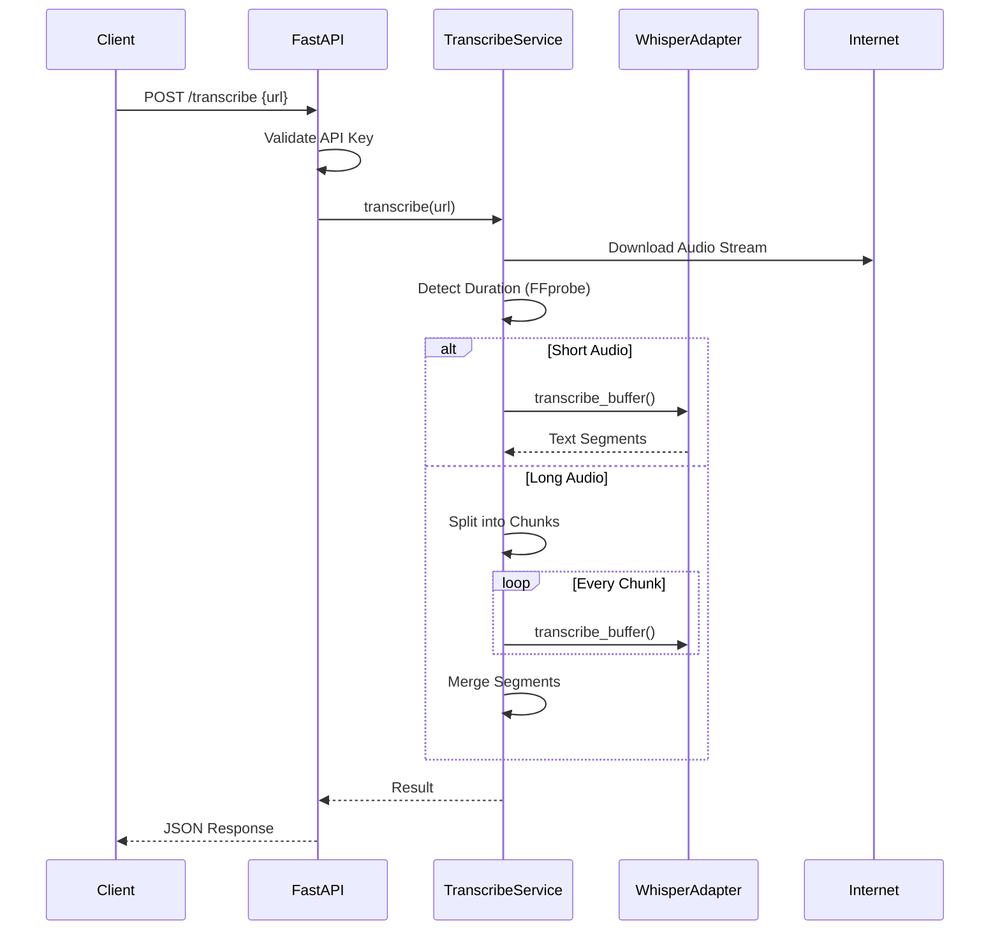

# Speech-to-Text Service

## Tổng Quan

**Speech-to-Text Service** là service cung cấp khả năng chuyển đổi giọng nói thành văn bản (ASR) chất lượng cao, sử dụng mô hình Whisper của OpenAI. Service này được thiết kế theo kiến trúc stateless, tối ưu hóa cho việc triển khai trên hạ tầng container (Docker/Kubernetes) với khả năng xử lý file âm thanh lớn thông qua cơ chế smart-chunking.

### Đặc Điểm Chính

| Đặc điểm | Mô tả |
|----------|-------|
| **Port** | 8000 |
| **Runtime** | Python 3.12+ |
| **Engine** | Whisper.cpp (Ctypes integration) |
| **Authentication** | API Key (X-API-Key header) |
| **Architecture** | Clean Architecture (3 layers) |
| **Deployment** | Docker Container (Linux x86_64) |

## Clean Architecture

Speech-to-Text Service sử dụng **3-layer Clean Architecture** để đảm bảo tính tách biệt và dễ bảo trì:



### Layer Responsibilities

#### 1. Delivery Layer (`internal/api`)
- **Routers**: Xử lý HTTP requests (`/transcribe`, `/health`).
- **Middleware**: Authentication, Error handling, Logging.
- **Schemas**: Validate input/output data (Pydantic).

#### 2. UseCase Layer (`services`)
- **TranscribeService**: Orchestrate luồng xử lý chính: Download -> Preprocess -> Transcribe -> Cleanup.
- **Business Logic**: Xử lý smart-chunking cho file lớn, tính toán adaptive timeout.

#### 3. Infrastructure Layer (`adapters`)
- **WhisperLibraryAdapter**: Giao tiếp trực tiếp với `libwhisper.so` qua Ctypes.
- **FFmpeg**: Xử lý convert format và detect duration.
- **MinIO**: Download model artifacts khi khởi động.

## Design Patterns và Trade-offs

### 1. Stateless Design & Eager Loading

Service được thiết kế hoàn toàn stateless. Model Whisper được load **ngay khi khởi động service** (Eager Loading) thay vì lazy loading.



| Approach | Latency (First Req) | Reliability | Resource Usage |
|----------|---------------------|-------------|----------------|
| **Eager Loading (Chosen)** | ⭐⭐⭐⭐⭐ Low | ⭐⭐⭐⭐⭐ Fail-fast | ⭐⭐⭐ High at startup |
| **Lazy Loading** | ⭐ High | ⭐⭐⭐ Risk at runtime | ⭐⭐⭐⭐⭐ Low at idle |

**Trade-offs:**
- ✅ **Consistent Latency**: Request đầu tiên nhanh như các request sau.
- ✅ **Fail Fast**: Nếu thiếu model file hoặc lỗi thư viện, service sẽ crash ngay lập tức (dễ debug).
- ❌ **Startup Time**: Thời gian khởi động lâu hơn (vài giây để load model vào RAM).

### 2. Direct Ctypes Integration

Thay vì gọi `whisper-cli` qua subprocess, service sử dụng `ctypes` để gọi trực tiếp shared library (`libwhisper.so`).

| Approach | Performance | Control | Complexity |
|----------|-------------|---------|------------|
| **Ctypes (Chosen)** | ⭐⭐⭐⭐⭐ High | ⭐⭐⭐⭐⭐ Fine-grained | ⭐⭐⭐ High |
| **Subprocess CLI** | ⭐⭐⭐ Medium | ⭐⭐ Limited | ⭐⭐⭐⭐⭐ Low |

**Lý do chọn Ctypes:**
- Tránh overhead của việc fork process mới cho mỗi request.
- Kiểm soát chi tiết bộ nhớ và trạng thái của model.
- Nhận callback progress realtime (future feature).

### 3. Smart Chunking Strategy

Xử lý file âm thanh dài (>30s) bằng cách chia nhỏ thành các đoạn ngắn có overlap.



**Cơ chế:**
- **Duration**: 30s per chunk.
- **Overlap**: 1-2s để tránh cắt giữa từ.
- **Sequential Processing**: Xử lý tuần tự để giữ RAM ổn định (Flat Memory Usage).

## Features

### Transcription Operations

| Method | Endpoint | Mô tả | Auth |
|--------|----------|-------|------|
| POST | `/transcribe` | Chuyển đổi audio từ URL thành text | ✅ |
| GET | `/health` | Kiểm tra trạng thái service và model | ❌ |

### Request Flow



## Data Model

### Transcription Response

```json
{
  "status": "success",
  "transcription": "Nội dung văn bản đã chuyển đổi...",
  "language": "vi",
  "duration": 45.5,
  "processing_time": 2.3,
  "confidence": 0.98,
  "segments": [
    {
      "start": 0.0,
      "end": 5.0,
      "text": "Nội dung đoạn 1"
    }
  ]
}
```

### Error Handling

Service trả về standard HTTP error codes:

| Code | Error Type | Mô tả |
|------|------------|-------|
| **400** | BadRequest | URL không hợp lệ hoặc thiếu tham số |
| **401** | Unauthorized | Sai hoặc thiếu API Key |
| **413** | PayloadTooLarge | File audio vượt quá giới hạn (500MB) |
| **422** | Validation | Sai format input data |
| **500** | InternalError | Lỗi xử lý nội bộ (Whisper crash, OOM) |

## Configuration & Deployment

### Environment Variables

| Variable | Default | Description |
|----------|---------|-------------|
| `WHISPER_MODEL_SIZE` | `base` | Kích thước model: `base`, `small`, `medium` |
| `WHISPER_N_THREADS` | `4` | Số luồng CPU sử dụng |
| `MAX_UPLOAD_SIZE_MB` | `500` | Giới hạn dung lượng file tải về |
| `INTERNAL_API_KEY` | - | Secret key để bảo vệ API |

### Docker Deployment

```bash
# Run with small model
docker run -d \
  -p 8000:8000 \
  -e WHISPER_MODEL_SIZE=small \
  -e INTERNAL_API_KEY=secret123 \
  stt-api:latest
```

## Integration Guide

### Python Client Example

```python
import requests

API_URL = "http://localhost:8000/transcribe"
API_KEY = "secret123"

payload = {
    "media_url": "https://example.com/audio.mp3",
    "language": "vi"  # Optional
}

headers = {
    "X-API-Key": API_KEY,
    "Content-Type": "application/json"
}

response = requests.post(API_URL, json=payload, headers=headers)
result = response.json()

print(f"Transcript: {result['transcription']}")
```

### cURL Example

```bash
curl -X POST http://localhost:8000/transcribe \
  -H "X-API-Key: secret123" \
  -H "Content-Type: application/json" \
  -d '{
    "media_url": "https://example.com/audio.mp3",
    "language": "vi"
  }'
```
